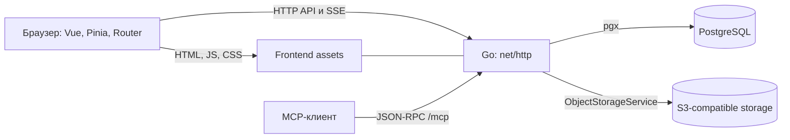

# Архитектура DnD Share

Приложение состоит из Vue frontend и Go backend. В production frontend
встраивается в один статический Go-бинарь; PostgreSQL хранит состояние,
S3-compatible storage — изображения, аудио и файлы 3D-моделей карт. Стек и обязательные правила
изменений задаёт [README репозитория](../README.md).

## Runtime и зависимости

Frontend использует общий пакет share-ui по фиксированному Git release tag.
Локальные компоненты отвечают за доменную модель, router, состояние и API;
общие поверхности, поля и взаимодействия принадлежат пакету.

Go использует stdlib ServeMux. Файлы фич регистрируют маршруты через
registerRoutes в init(); middleware разрешает сессию, обрабатывает CORS и
паники. Неизвестные пути API и MCP возвращают 404, остальные клиентские пути
обрабатывает SPA.

## Запуск и завершение

main.go загружает конфигурацию и открывает Store. До HTTP-запуска применяется
актуальная схема: versioned runner выполняет ещё не отмеченные SQL-файлы под
PostgreSQL advisory lock. Применённые checksum защищают историю миграций.

Затем очищаются просроченные пользовательские сессии и прерываются jobs,
оставшиеся RUNNING после рестарта. Создаётся storage service и запускается
HTTP-сервер. SIGINT и SIGTERM запускают graceful shutdown с ограниченным временем.

## Путь изменения данных

| Уровень | Ответственность | Где смотреть |
| --- | --- | --- |
| UI фичи | Действие пользователя, черновик, загрузка и ошибка | frontend/src/features/ |
| Общий UI | Поверхности, поля, меню, базовые взаимодействия | share-ui и frontend/src/shared/ui/ |
| API-клиент | HTTP-запрос и обработка non-2xx | frontend/src/shared/api/ и клиенты фич |
| HTTP handler | Сессия, роль, валидация и DTO | internal/web/ |
| Store | Запросы, транзакции и проверки версий | internal/store/ |
| Хранение | Текущая схема и JSON-контракт | internal/store/schema/ и страницы БД |
| Object storage | Upload, presign, удаление объектов | internal/storage/ |

Мутирующие операции проверяют права на сервере. Для документов с технической
версией или revision контракт описывает конфликт и сохранение локального
черновика. События SSE сигнализируют об изменении; конкретная фича определяет,
как обновить snapshot, не затерев локальную правку.

Игровая система и редакция аккаунта, персонажа и сессии имеют разные назначения.
Глобальный выбор задаёт поиск и навигацию; открытый лист использует собственную
редакцию. [Контракт редакций](features/rules-editions.md) описывает эти границы.

## Разработка и выпуск

Локально Vite работает на 5173 и проксирует API/MCP на Go-сервис 8080.
Production build помещает frontend в frontend/target/dist; deploy копирует его
в internal/assets/dist перед сборкой бинаря. Readiness подтверждает состояние
БД и точный commit выпущенного изменения.

Рабочие команды: [локальная разработка](../README.md#локальная-разработка),
[проверки](../README.md#проверки), [деплой и окружение](deploy.md).

## Связанные страницы

[Оглавление wiki](README.md) · [Frontend](frontend.md) · [HTTP API](api.md) · [БД](database.md) · [MCP](features/mcp.md)
