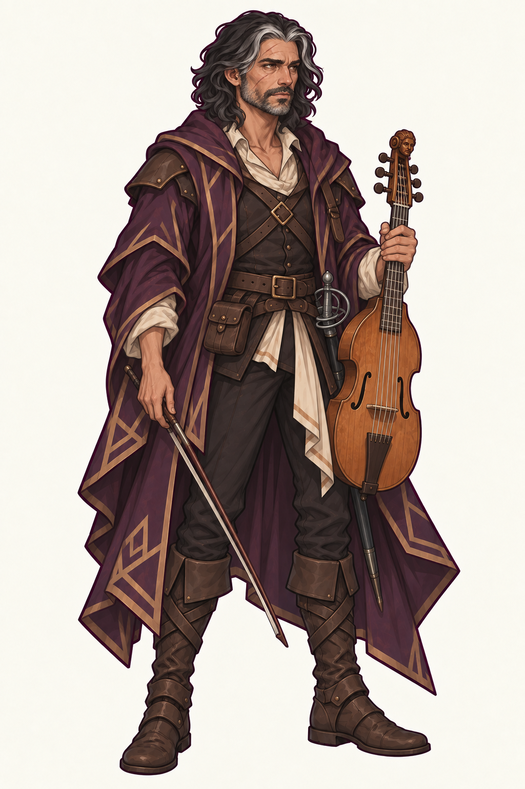
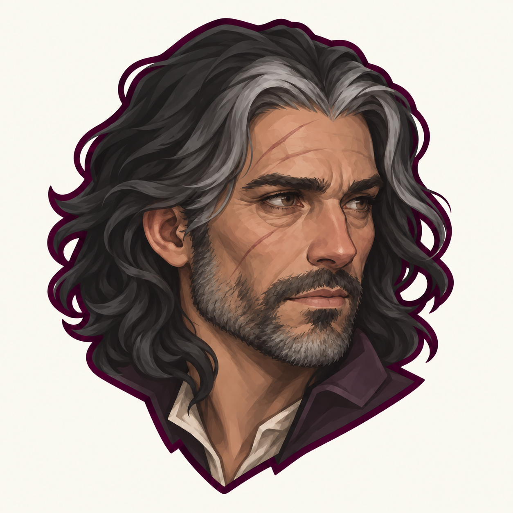
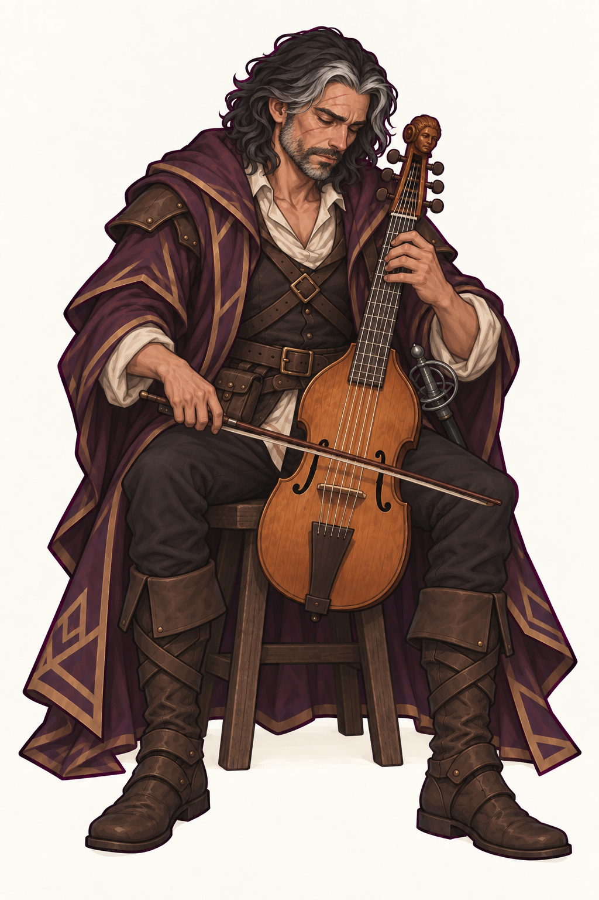
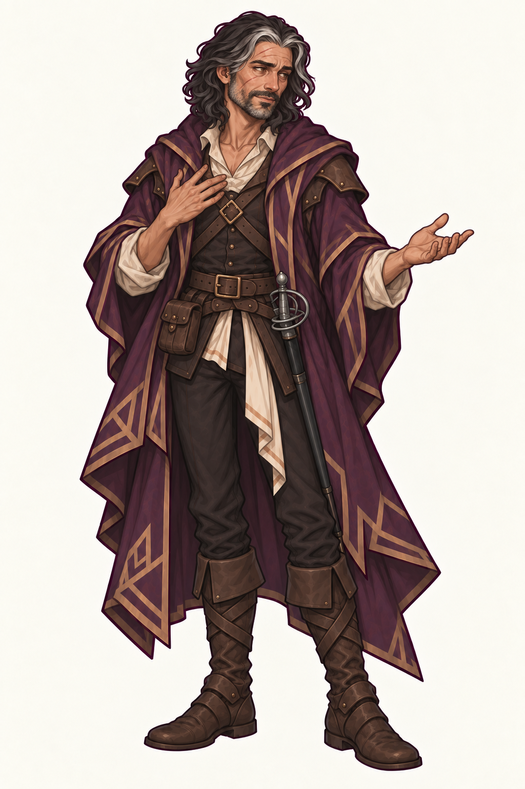
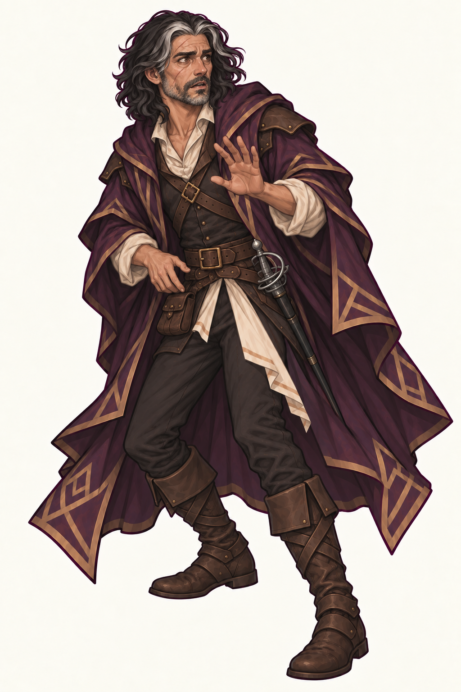
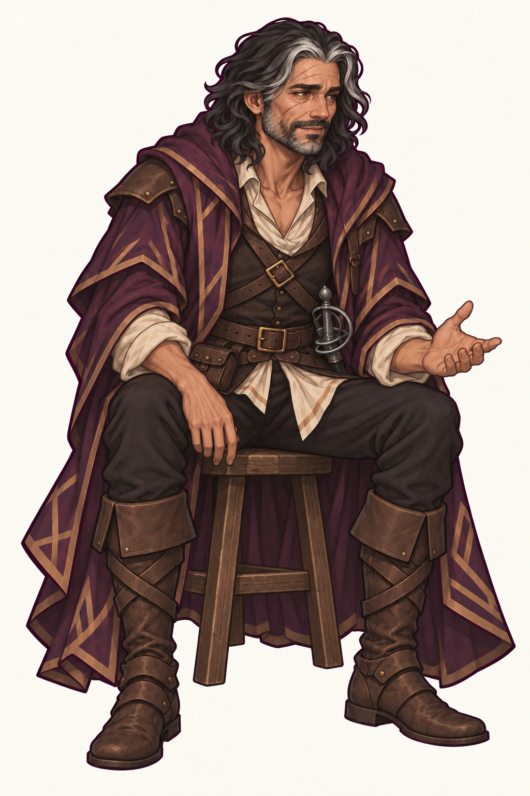

# Историкус

Историкус — человек, бард Коллегии Знаний. Его основная черта — усталость
человека с большим пережитым опытом, способного на иронию, увлечённость,
тревогу и тёплую радость. Он принадлежит тому же визуальному миру, что Лиссара.
[Лист персонажа](https://dndshare.ru/char/07ae13a7-83ca-44a9-a9f6-ef7dbe1b3695)
задаёт биографию и снаряжение; внешность задают принятые портрет и полный рост.

## Канон

- смуглая кожа, карие глаза, округлые человеческие уши, вытянутое угловатое
  лицо с заметным носом и неровными плоскостями щёк;
- тяжёлые веки, мешки под глазами, складки на лбу и возле рта, морщинки
  у глаз, зажившие диагональные шрамы на лбу и щеке;
- неровная короткая борода и щетина с сединой, без аккуратной барберской окантовки;
- тёмные волнистые волосы до плеч, широкие седые пряди у пробора и висков,
  слегка растрёпанные локоны;
- высокий взрослый мужчина с естественными пропорциями; возраст в листе —
  37 лет, но лицо намеренно выглядит изношенным и старше календарного возраста;
- длинный сливовый плащ с угловатой отделкой приглушённым старым золотом,
  коричневый кожаный доспех, открытый ворот светлой рубашки, пояс с небольшой
  сумкой, тёмные брюки и потёртые коричневые сапоги;
- базовый инструмент — деревянная виола со смычком: янтарно-коричневый
  корпус с выраженной талией и двумя резонаторными отверстиями, длинный
  гриф с ладами, шесть струн, фигурная резная головка и боковые колки.
  Форму и размер сверяют с `canonical.png`; при игре инструмент держат
  вертикально между коленями, без шпиля;
- рапира на поясе; в текущих референсах она остаётся в ножнах;
- детализированный 2D fantasy render в стиле Лиссары: чистые тёмно-сливовые
  линии, матовые материалы, читаемые угловатые плоскости и контролируемая
  cel-painted светотень, без глянцевой ретуши и живописного шума.

Лицо, шрамы, седина, борода, человеческие уши, костюм и палитра сохраняются
между сценами. Усталость не означает одно неизменное суровое выражение:
улыбка углубляет складки, тревога приподнимает веки, но мешки под глазами,
морщины и неровность лица остаются. Не омолаживать и не приглаживать его
ради новой эмоции. Для свободных жестов виола и смычок могут отсутствовать.

## Портретная иконка

[Исходник](portrait-icon.png) · [128×128](portrait-icon-128.webp).
Принятая иконка — основной референс лица, включая степень усталости и
возрастные признаки. Полный рост построен от неё.

## Библиотека поз и эмоций

| Референс | Назначение |
| --- | --- |
|  | Увлечённость: сидит с виолой между коленями, опустив голову, сосредоточен на музыке. |
|  | Ирония: открытый жест рассказчика, приподнятая бровь и небольшая асимметричная улыбка. |
|  | Тревога: шаг назад, защитная ладонь, приоткрытый рот и напряжённый взгляд. |
|  | Тихая радость: расслабленно сидит, мягко улыбается и жестикулирует в разговоре. |

Каждая поза создана независимо от канонического полного роста и иконки.
Для обложек персонажа заново ставят в нужную сцену, не вставляя готовую позу
и не используя предыдущую обложку как новый референс личности.

У PNG светлый непрозрачный фон. Это референсы персонажа, а не системные
иконки справочника с контрактом прозрачности из `md/features/items.md`.
Созданы встроенным imagegen; [промпты](generation-prompts.md).
