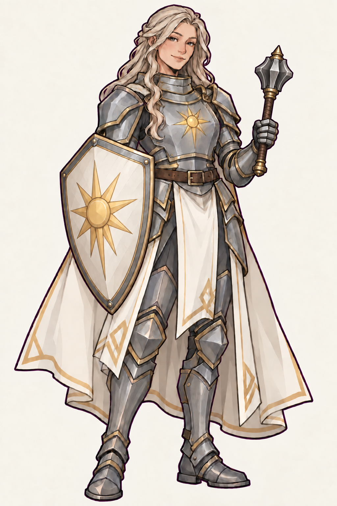
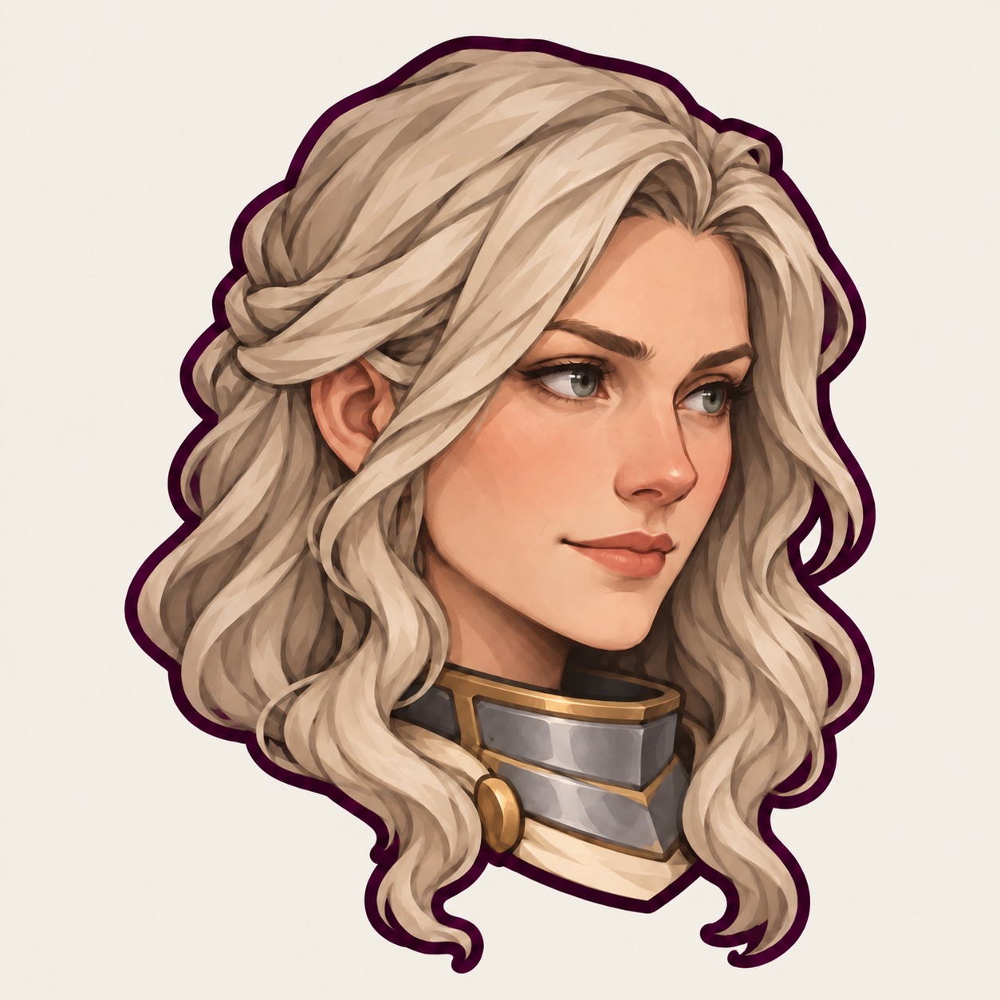
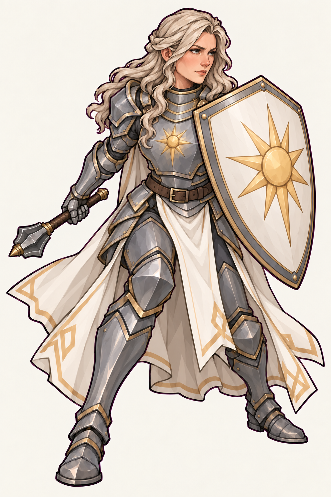
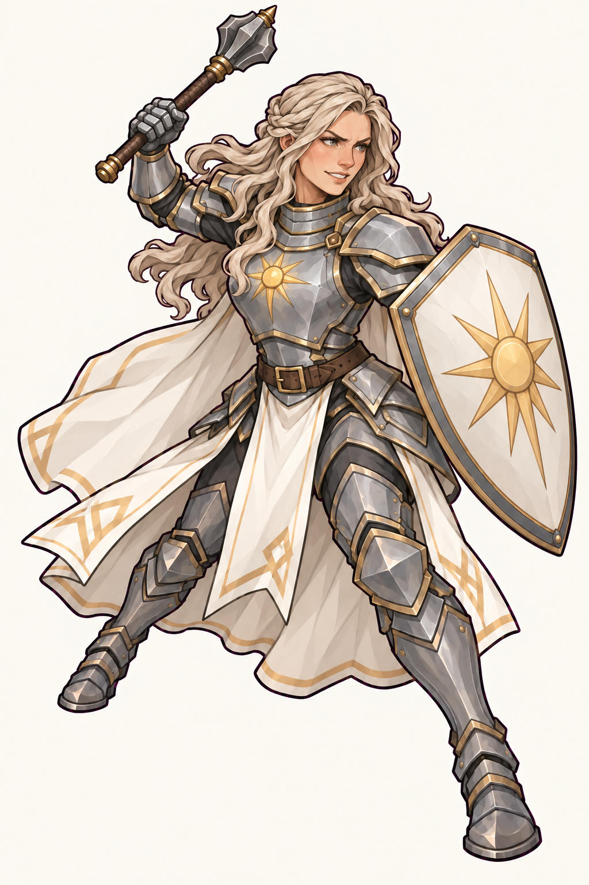
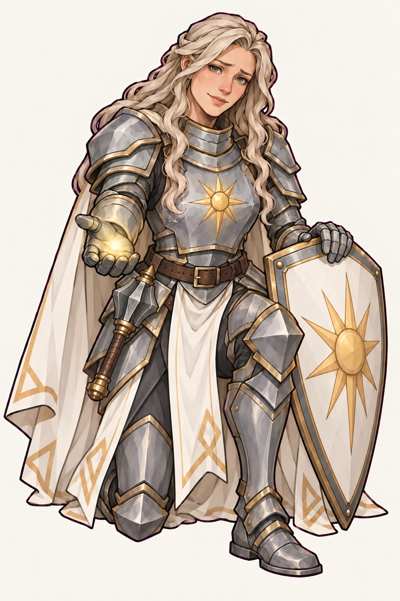
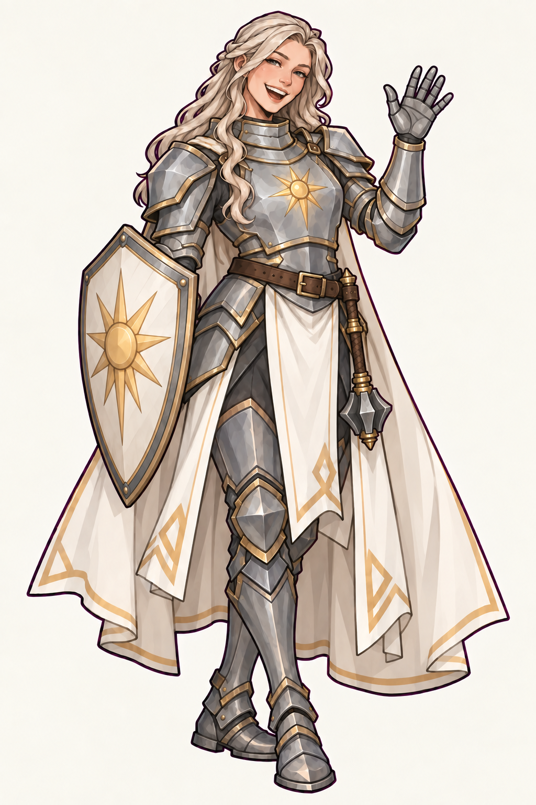
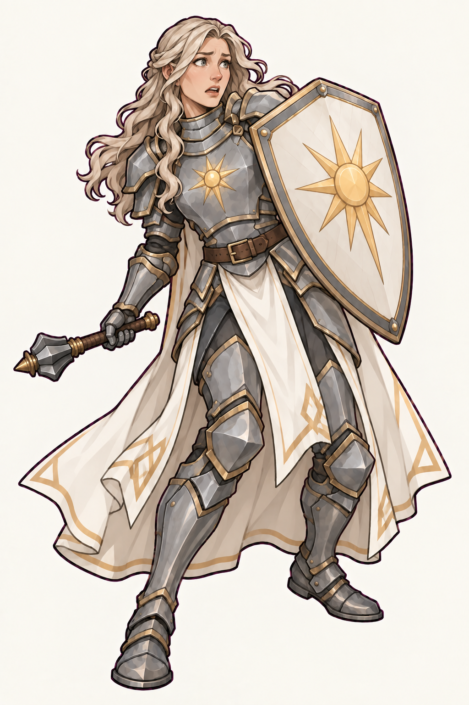

# Серафина

Серафина — взрослая женщина-человек, маскот паладина. Её базовый характер —
теплота, забота и спокойная уверенность; в бою она остаётся собранной
защитницей. Она принадлежит тому же визуальному миру, что Лиссара.

## Канон

- зрелое, мягко угловатое лицо, выраженные скулы и естественные пропорции;
  светлая тёплая кожа, серо-зелёные глаза, небольшие округлые человеческие уши;
- длинные волнистые пепельно-светлые волосы с боковым пробором, убранными от
  лица прядями и крупными читаемыми локонами;
- матовые серебристо-серые латы: высокий горжет, угловатые наборные наплечники,
  цельная кираса с одним золотым солнцем, латные перчатки, набедренники,
  поножи и практичные бронированные сапоги без высокого каблука;
- умеренная окантовка старым золотом, узкий коричневый кожаный пояс,
  длинный светлый плащ и разрезные полотнища с редкими угловатыми золотыми
  мотивами по краям;
- одноручная булава: увесистая ребристая стальная головка, удобная
  рукоять в коричневой обмотке, сдержанные золотистые обоймы и навершие.
  Пропорции сохраняют по `canonical.png`: стальная головка немного короче
  лица и уже головы, полная длина примерно 50–55 см, головка около 12–15 см.
  Это ориентиры рисунка: оружие не превращают ни в тонкий жезл, ни в
  огромную двуручную дубину;
- светлый каплевидный щит со стальным ободом, тонкой золотой окантовкой и
  одним крупным золотым солнцем;
- детализированный 2D fantasy render в стиле Лиссары: чистый тёмно-сливовый
  контур, матовые угловатые плоскости, сдержанная палитра и контролируемая
  cel-painted светотень без глянца и живописного шума.

Лицо, человеческие уши, причёска, палитра, конструкция доспехов и дизайн
снаряжения не меняются между изображениями. Поза, ракурс и эмоция зависят от
сцены: мягкая улыбка не обязательна в опасности или бою. Для свободного жеста
булава может быть закреплена на поясе, а щит — опущен или поставлен рядом.
Свеча, меч, посох, рога, крылья и эльфийские уши в базовый образ не входят.

## Портретная иконка

[Исходник](portrait-icon.png) и [версия 128×128](portrait-icon-128.webp)
показывают голову в три четверти с поворотом вправо и коротким горжетом.
Это отдельная портретная композиция, а не уменьшенный полный рост.

## Библиотека поз и эмоций

| Референс | Назначение |
| --- | --- |
|  | Защита: устойчивая стойка, щит вперёд, собранная решимость. |
|  | Бой: выпад, замах булавой, уверенный боевой азарт. |
|  | Забота: на одном колене, протянутая ладонь с тёплым светом, сочувствие. |
|  | Общение: свободный приветственный жест, открытая радость и смех. |
|  | Уязвимость: отступление, защитный рефлекс, испуг и удивление. |

Каждая иллюстрация построена независимо от одного канонического полного
роста и портретного референса. Предыдущую позу не используют как исходник
для следующей. Для обложек заново ставят персонажа в нужную сцену, а не
вставляют готовую позу поверх окружения.

У файлов светлый непрозрачный фон: встроенный генератор не сохранил
настоящий alpha-канал. Это референсы маскота, а не готовые системные иконки
справочника с контрактом прозрачности из `md/features/items.md`.

Изображения созданы встроенным imagegen. [Промпты](generation-prompts.md).
