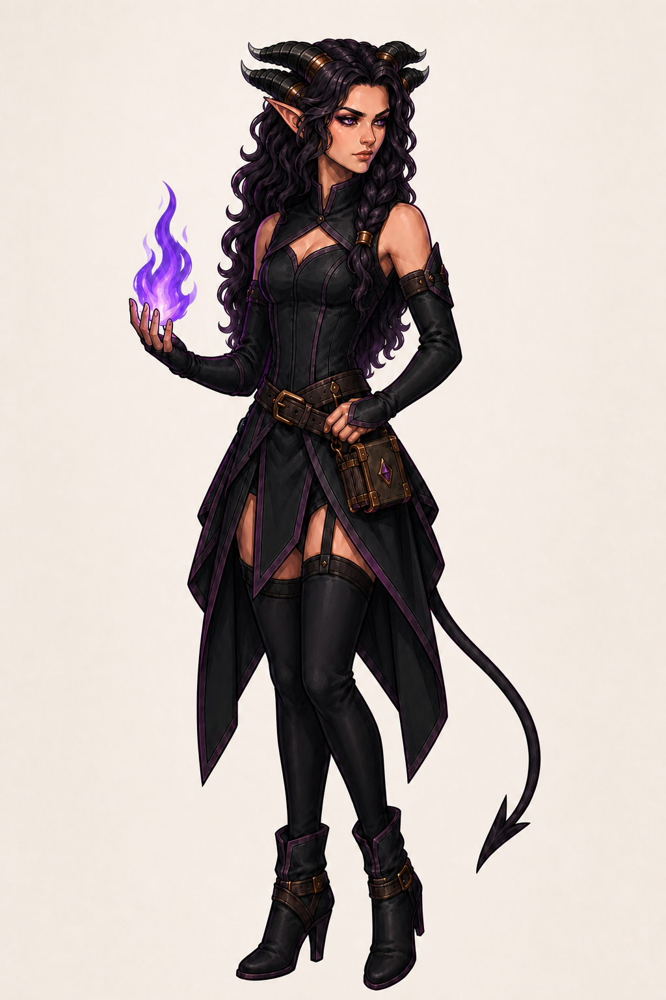

# Сильви

Сильви — взрослая тифлингша-арканистка, маскот для волшебника, чародея и
колдуна. Она выше Лиссары примерно на 10 см, но лицо у обеих героинь остаётся
сопоставимого размера. Сильви не используется как логотип или favicon.

## Канон

- тёплая приглушённая розовато-бежевая кожа; чёрные склеры, фиолетовые радужки
  и чёрные зрачки; длинные заострённые уши;
- объёмные волнистые волосы чёрно-фиолетового цвета до талии и одна толстая
  коса до пояса с бронзовой обоймой;
- ровно четыре ребристых обсидиановых рога: по два близких параллельных рога с
  каждой стороны головы; обе пары начинаются за макушкой, низко проходят вдоль
  волос и уходят назад, а дальняя пара естественно сокращается перспективой;
- отдельных лобных рогов и центрального пятого рога нет; на основаниях четырёх
  рогов находятся сдержанные бронзовые обоймы, кончики слегка высветлены;
- симметричный компактный угольно-чёрный корсет до талии с небольшим вырезом,
  геометрической прострочкой без рун и отдельными длинными перчатками-рукавами;
- пояс с одним компактным бронзовым фолиантом, угловатые тёмные фалды со
  сливовой окантовкой и открытыми бёдрами, чёрные чулки выше бедра, практичные
  ботильоны на каблуке и тонкий хвост с наконечником-лопаткой;
- локальные фиолетовые магические эффекты без читаемых символов;
- тот же детализированный 2D fantasy render, чистые тёмно-сливовые линии и
  контролируемая cel-painted светотень, что у Лиссары.

Лицо, глаза, количество и расположение рогов, длина волос, базовый костюм и
палитра не меняются между обложками. Посох, меч, ножны, дополнительные книги и
дублирующий поясной фолиант в базовый образ не входят.

## Библиотека поз и эмоций

| Файл | Назначение |
| --- | --- |
| [focused-casting.png](focused-casting.png) | Сосредоточенное колдовство: собранная стойка, точное формирование фиолетовой спирали. |
| [confident-flourish.png](confident-flourish.png) | Уверенность и инициатива: динамичный поворот, полуулыбка, широкий магический жест. |
| [knowing-spark.png](knowing-spark.png) | Хитрость и общение: спокойная стойка, понимающая полуулыбка и один маленький огонёк на пальце. |
| [defensive-ward.png](defensive-ward.png) | Угроза и защита: напряжённая стойка, тревога и компактный фиолетовый щит. |
| [startled-backlash.png](startled-backlash.png) | Уязвимость и магическая ошибка: естественный испуг и сорвавшийся небольшой эффект. |

Иллюстрации сделаны как независимые сцены от одного канонического образа, а не
последовательными правками предыдущих обложек. Это исключает накопление шума и
дрейф анатомии. Нейтральный однотонный фон выбран намеренно: встроенный
генератор не сохранил настоящий alpha-канал для новых PNG.
