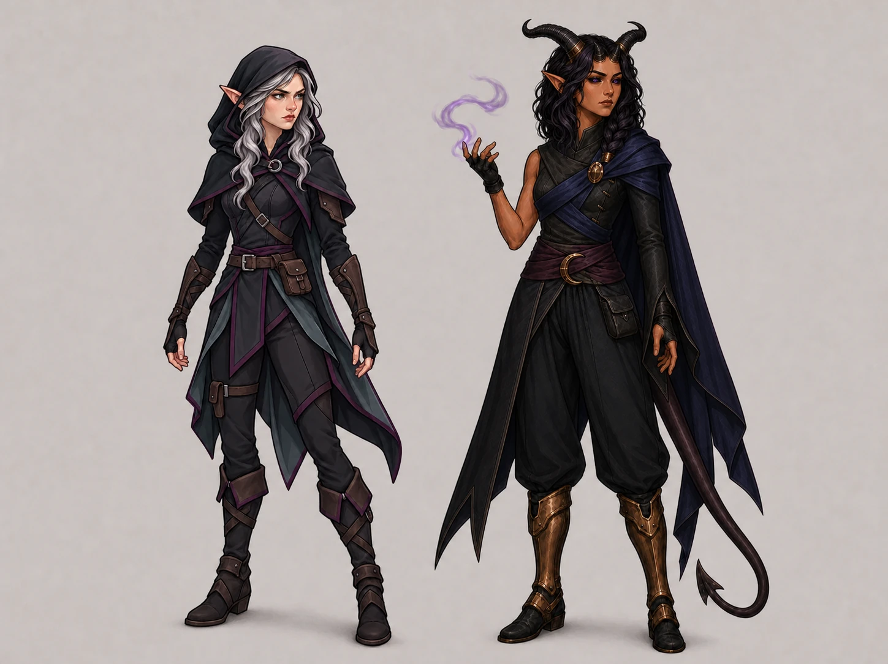
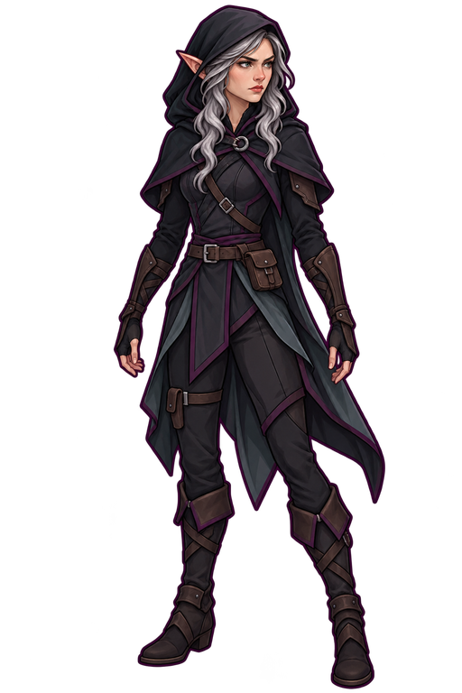
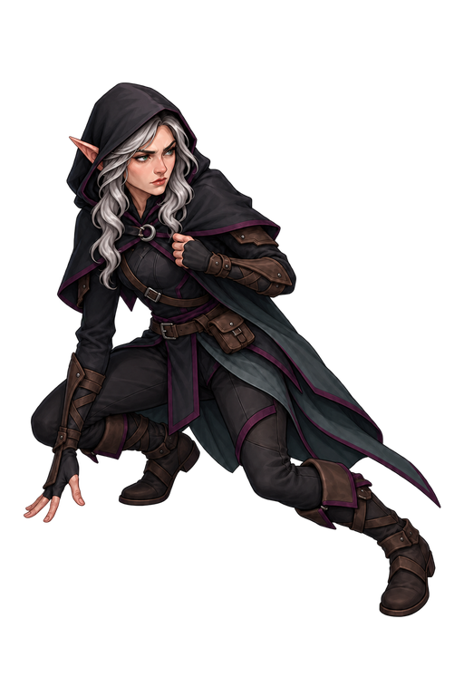
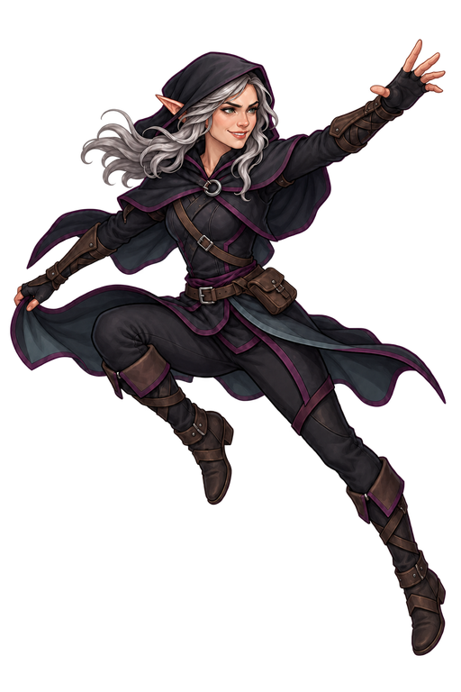
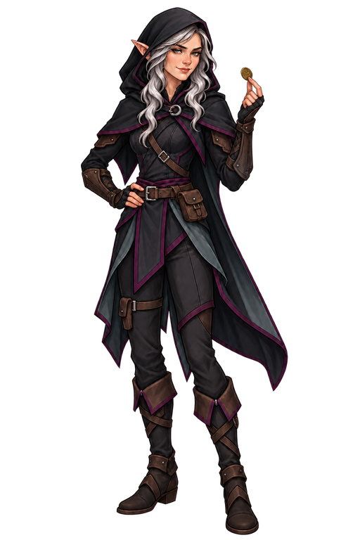
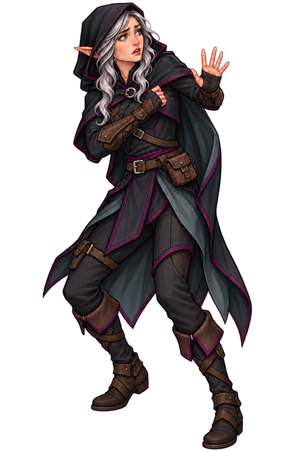
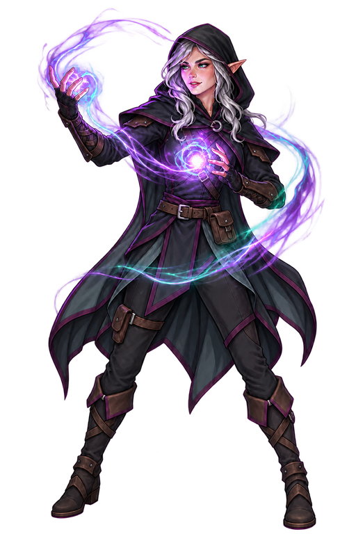

# Маскоты DnD Share

В проекте используется повторяющийся состав персонажей для сюжетных обложек.
Первый персонаж — взрослая сереброволосая эльфийка Лиссара в тёмном дорожном
костюме. Второй — тифлингша-арканистка Сильви. Они связывают бренд-портрет
приложения и обложки справочника; отдельного персонажа для favicon или шапки
нет.

## Общий визуальный стиль

Обеих героинь рисуют как персонажей одного мира: детализированный 2D fantasy
render с контролируемой cel-painted светотенью, чистыми тёмными линиями,
угловатой конструкцией одежды и сдержанной фактурой. Плотность деталей,
анатомические пропорции, построение лица и характер света должны совпадать.
Фотореализм, живописный шум и стилистическое упрощение одного персонажа рядом
с другим не допускаются.

## Лиссара

Неизменяемые признаки:

- зрелое угловатое лицо, светлые серо-зелёные глаза и длинные заострённые уши;
- длинные волнистые серебряные волосы;
- почти чёрный угловатый капюшон и короткая мантия с круглой застёжкой;
- многослойная тёмная туника, диагональная кожаная перевязь, пояс, небольшие
  сумки, наручи, асимметричные серо-бирюзовые фалды и обмотанные сапоги;
- глубокий сливовый контур и акценты;
- детализированный 2D fantasy render с контролируемой cel-painted светотенью.

Лицо, причёска, уши, капюшон, застёжка, основные слои костюма и палитра
сохраняются между изображениями. Оружие, магия, поза, ракурс и выражение лица
определяются конкретной сценой.

## Сильви

Сильви — взрослая тифлингша-арканистка с тёплой оливково-бронзовой кожей,
чёрно-фиолетовыми волнистыми волосами и толстой косой. Неизменяемые признаки:

- чёрные склеры, отчётливые фиолетовые радужки и чёрные зрачки;
- ровно четыре рога: два небольших сближенных рога на верхней части лба и два
  крупных ребристых обсидиановых рога сразу за ними, направленных назад;
- сдержанные бронзовые обоймы на рогах и длинные заострённые уши;
- асимметричный угольно-чёрный тканевый дублет: одна открытая рука для магии и
  один длинный облегающий рукав;
- диагональные драпировки цвета ночного индиго, одноплечая полумантия,
  дымчато-сливовая обмотка пояса, свободные тёмные брюки и бронзовые поножи;
- длинный хвост и небольшие фиолетовые магические эффекты без читаемых рун.

Лицо, глаза, количество и иерархия рогов, причёска и асимметрия костюма
сохраняются между сценами. Посох, меч и ножны в базовый образ не входят.

## Библиотека поз и эмоций

| Референс | Назначение |
| --- | --- |
|  | Скрытность и наблюдение: низкая стойка, настороженный взгляд, сдержанное напряжение. |
|  | Скорость и ловкость: открытая динамическая поза, азарт и уверенная улыбка. |
|  | Общение и хитрость: расслабленная стойка, понимающая полуулыбка, один простой предмет в руке. |
|  | Опасность и уязвимость: защитный жест, широко раскрытые глаза и естественный испуг. |
|  | Магия: сосредоточенный интерес, отражённый свет и один крупный поток энергии без читаемых рун. |

Эти файлы задают допустимый диапазон пластики и эмоций Лиссары, а не набор поз
для буквальной вставки. Новую сцену строят от механики предмета и заново ставят
персонажа в её перспективе, освещении и взаимодействии с окружением.

## Использование на обложках

- Сначала читают название, структурированные данные и описание способности,
  черты или заклинания, затем выбирают конкретный момент, в котором механика
  проявляется.
- Канонический образ или библиотека поз являются единственным референсом
  персонажа. Готовую обложку не используют как промежуточный character
  reference для следующей обложки: такое повторное переиспользование искажает
  анатомию, позу и выражение лица.
- Поза и эмоция должны отвечать сцене. Не повторяют нейтрально-суровое лицо по
  умолчанию; сосредоточенность, азарт, дружелюбная хитрость, страх, удивление и
  другие состояния допустимы при сохранении личности.
- Плотность деталей персонажа и окружения должна совпадать. Нельзя вставлять
  упрощённую flat-cartoon фигуру в более детализированную сцену или маскировать
  несоответствие контурным свечением.
- На панорамной обложке сохраняют лицо, уши, руки, ключевой инструмент и эффект
  внутри внешнего crop. Текст, читаемые руны, рамки, UI, логотипы и водяные
  знаки в изображение не добавляют.
- Магия может менять локальный свет и цвет эффекта, но не цвет волос, глаз,
  кожи, капюшона и базового костюма.

## Отношение к бренд-знаку

Маскоты не используются как логотип или favicon: в малом размере лица и
характерные признаки персонажей перестают читаться. Для сайта используется
отдельный знак фиолетового зелья из `frontend/public/brand-mark.webp`, а
персонажи остаются героями сюжетных обложек и иллюстраций.
